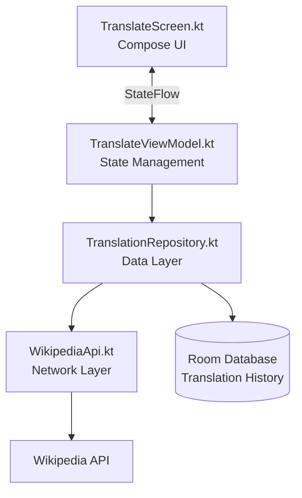
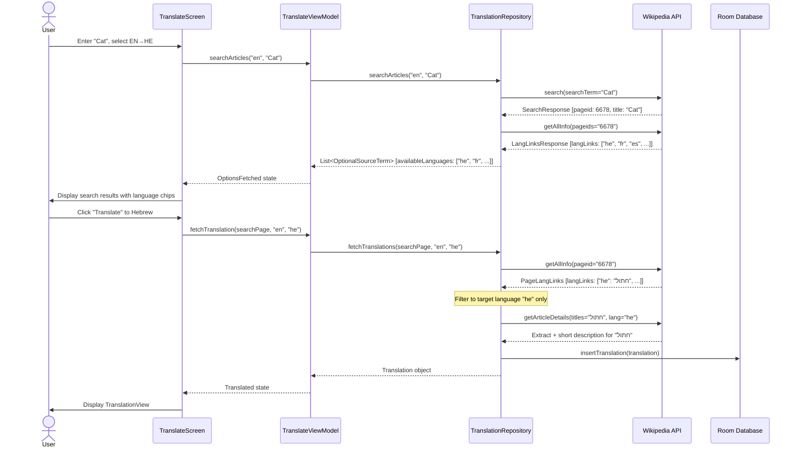
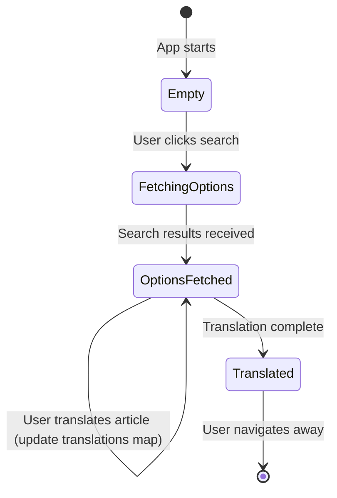
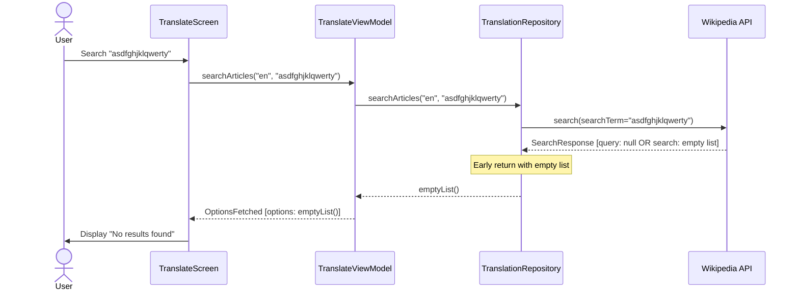
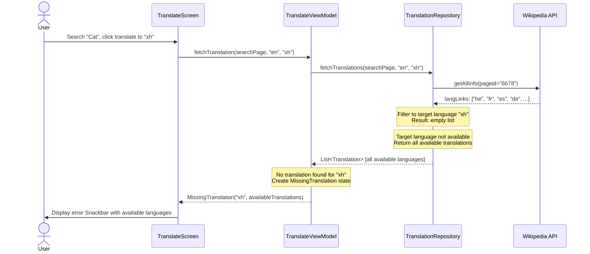
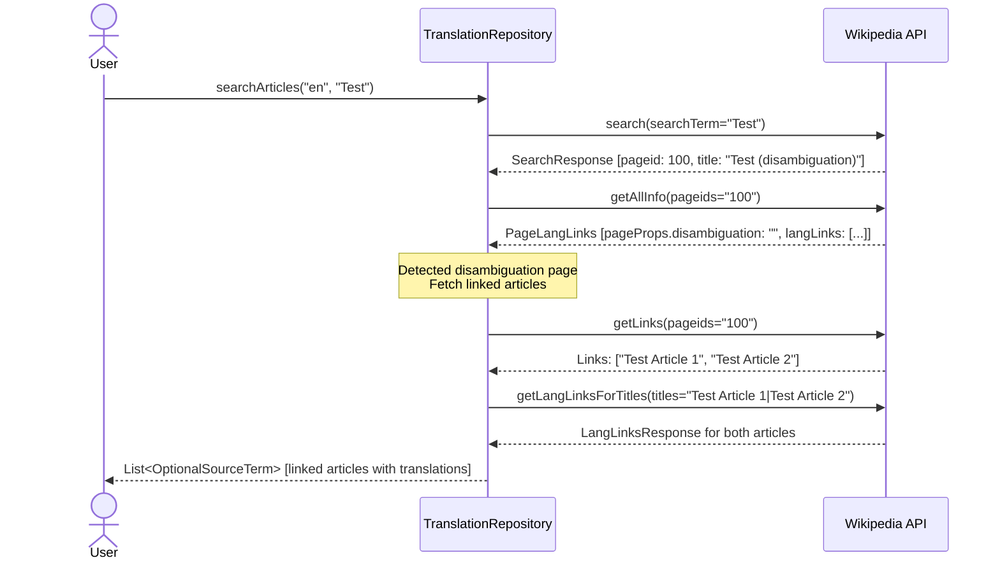
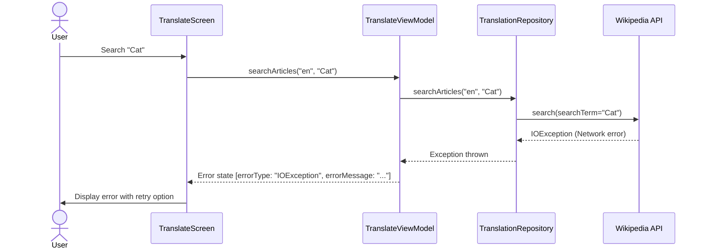

# Translation Flow Documentation

This document describes the complete flow of how translations work in Janus, from user input to final display.

## Architecture Overview



## Core Data Models

### OptionalSourceTerm
Represents a search result with available translations:
```kotlin
data class OptionalSourceTerm(
    val pageid: Long,              // Wikipedia page ID
    val title: String,             // Article title
    val snippet: String,           // HTML search snippet
    val availableLanguages: List<String>  // Available translation language codes
)
```
**File**: `app/src/main/java/com/anysoftkeyboard/janus/app/repository/TranslationRepository.kt`

### Translation
Represents a complete translation with source and target article details:
```kotlin
data class Translation(
    val sourceWord: String,
    val sourceLangCode: String,
    val sourceArticleUrl: String,
    val sourceShortDescription: String?,
    val sourceSummary: String?,
    val translatedWord: String,
    val targetLangCode: String,
    val targetArticleUrl: String,
    val targetShortDescription: String?,
    val targetSummary: String?
)
```
**File**: `database/src/main/java/com/anysoftkeyboard/janus/database/entities/Translation.kt`

## Flow 1: Happy Path - Successful Translation

### Example
**Input**: User searches for "Cat" from English to Hebrew
**Output**: Displays "Cat" → "חתול" with descriptions and summaries



### API Calls in Happy Path
1. **Search**: `GET api.php?action=opensearch&search=Cat`
2. **Get Language Links**: `GET api.php?action=query&prop=langlinks|pageprops&pageids=6678`
3. **Get Source Details**: `GET api.php?action=query&prop=langlinks|pageprops&pageids=6678` (during translation)
4. **Get Target Details**: `GET api.php?action=query&prop=extracts|pageprops&titles=חתול` (only for "he")

### State Transitions


### Code Flow
1. **UI Entry**: `app/src/main/java/com/anysoftkeyboard/janus/app/ui/TranslateScreen.kt`
   - User input and search button trigger

2. **ViewModel**: `app/src/main/java/com/anysoftkeyboard/janus/app/viewmodels/TranslateViewModel.kt`
   - `searchArticles()`: Initiates search
   - `fetchTranslation()`: Initiates translation for selected article

3. **Repository**: `app/src/main/java/com/anysoftkeyboard/janus/app/repository/TranslationRepository.kt`
   - `searchArticles()`: Performs search and gets language links
   - `fetchTranslations()`: Fetches translation details (optimized to target language only)

4. **API**: `network/src/main/java/com/anysoftkeyboard/janus/network/WikipediaApi.kt`
   - `search()`: Wikipedia search endpoint
   - `getAllInfo()`: Get langlinks and page properties
   - `getArticleDetails()`: Get extracts and descriptions

5. **Display**: `app/src/main/java/com/anysoftkeyboard/janus/app/ui/states/TranslationView.kt`
   - Shows source article with snippet and description
   - Shows target article with description and summary

## Flow 2: Empty Search Results

### Example
**Input**: User searches for "asdfghjklqwerty"
**Output**: Empty search results, no API calls for language links



### Code Logic
**File**: `app/src/main/java/com/anysoftkeyboard/janus/app/repository/TranslationRepository.kt`

```kotlin
// Case 1: query is null
return searchResponse.query?.search?.let { ... } ?: emptyList()

// Case 2: search list is empty
if (it.isEmpty()) {
  return emptyList()
}
```

**Optimization**: When search returns empty, we skip the `getAllInfo()` API call since there are no pageids to query.

## Flow 3: No Translation Available for Target Language

### Example
**Input**: User searches for "Cat", tries to translate to a language not available (e.g., "xh" - Xhosa)
**Output**: Shows error with available translations



### Code Logic
**File**: `app/src/main/java/com/anysoftkeyboard/janus/app/repository/TranslationRepository.kt`

```kotlin
val targetLangLinks = langLinks.filter { it.lang == targetLang }
if (targetLangLinks.isEmpty()) {
  // Target language not available, return all available translations for error handling
  return langLinks.map { link ->
    Translation(
        // ... maps all available translations with null for target details
        targetShortDescription = null,
        targetSummary = null,
    )
  }
}
```

**File**: `app/src/main/java/com/anysoftkeyboard/janus/app/viewmodels/TranslateViewModel.kt`

```kotlin
val langTranslation = translations.find { it.targetLangCode == targetLang }
val translationState = if (langTranslation == null) {
  TranslationState.MissingTranslation(targetLang, translations)
} else {
  TranslationState.Translated(langTranslation)
}
```

### UI Behavior
**File**: `app/src/main/java/com/anysoftkeyboard/janus/app/ui/states/TranslationContent.kt`

Displays Snackbar: "Translation to {targetLang} not found. Available translations: {langCodes}"

## Flow 4: Disambiguation Pages

### Example
**Input**: User searches for "Test"
**Output**: Wikipedia returns disambiguation page, we fetch linked articles instead



### Code Logic
**File**: `app/src/main/java/com/anysoftkeyboard/janus/app/repository/TranslationRepository.kt`

```kotlin
val disambArticles = articlesLinks.query?.pages?.values
    ?.filter { p -> p.pageProps?.disambiguation != null } ?: emptyList()

if (disambArticles.isNotEmpty()) {
  // Fetch links from disambiguation page
  val links = api.getLinks(disambArticles.map { p -> p.pageid }.joinToString("|"))
  val titlesOfLinks = links.query?.pages?.values?.map { p -> p.links?.map { l -> l.title } ?: listOf() } ?: emptyList()
  val flattenedTitles = titlesOfLinks.flatten()

  if (flattenedTitles.isEmpty()) {
    return emptyList()  // No links found
  }

  val fullLinks = api.getLangLinksForTitles(flattenedTitles.joinToString("|"))
  // Return linked articles as search results
}
```

### Special Case: Disambiguation with No Links
**Example**: "What's up" disambiguation page has no links

**Behavior**: Returns empty list without calling `getLangLinksForTitles` with empty string

## Flow 5: Network Error

### Example
**Input**: User searches but network is unavailable
**Output**: Error state displayed



### Error Handling
**File**: `app/src/main/java/com/anysoftkeyboard/janus/app/viewmodels/TranslateViewModel.kt`

```kotlin
try {
  _state.value = TranslateViewState.OptionsFetched(
      term, repository.searchArticles(sourceLang, term), emptyMap())
} catch (e: Exception) {
  Log.e("TranslateViewModel", "Error fetching search results", e)
  val errorType = e.javaClass.simpleName
  val errorMessage = e.message ?: "Unknown error occurred"
  _state.value = TranslateViewState.Error(errorType, errorMessage)
}
```

### UI Display
**File**: `app/src/main/java/com/anysoftkeyboard/janus/app/ui/states/ErrorView.kt`

Shows error type and message with retry button.

## Flow 6: JSON Parsing Error

### Example
**Input**: User searches for term with special characters that causes empty pageids parameter
**Output**: JsonDataException caught and displayed

### Previous Bug (Fixed)
When disambiguation page had no links, code would create empty string for titles parameter:
```
api.php?action=query&titles=
```

Wikipedia returns invalid JSON, causing `JsonDataException`.

### Fix
**File**: `app/src/main/java/com/anysoftkeyboard/janus/app/repository/TranslationRepository.kt`

```kotlin
if (flattenedTitles.isEmpty()) {
  return emptyList()  // Early return, don't make API call with empty titles
}
```

Also applied to search results:
```kotlin
if (it.isEmpty()) {
  return emptyList()  // Don't call getAllInfo with empty pageids
}
```

## Performance Optimization: Target Language Filtering

### Problem
Originally, code fetched article details for **ALL** available translations (10-50+ languages) when user only requested ONE target language.

### Solution
Filter langLinks to target language **before** making API call:

```kotlin
// Filter to only the target language the user requested
val targetLangLinks = langLinks.filter { it.lang == targetLang }

if (targetLangLinks.isEmpty()) {
  // Handle missing translation case
}

// Make API call for ONLY target language
val titles = targetLangLinks.joinToString("|") { it.title }
val targetApi = wikipediaApi.createWikipediaApi(targetLang)
val detailsResponse = targetApi.getArticleDetails(titles)
```

**Impact**: Reduced from N API calls (one per available language) to **1 API call** (only for target language).

**File**: `app/src/main/java/com/anysoftkeyboard/janus/app/repository/TranslationRepository.kt`

## Wikipedia API Endpoints Reference

### 1. Search
**Endpoint**: `GET api.php?action=opensearch&search={term}&format=json`
**Purpose**: Find articles matching search term
**Returns**: List of matching articles with pageids, titles, snippets

### 2. Get Language Links
**Endpoint**: `GET api.php?action=query&prop=langlinks|pageprops&pageids={pageids}&format=json`
**Purpose**: Get available translations and page properties
**Returns**: Map of pageids to langlinks (list of language codes + titles)

### 3. Get Links (for disambiguation)
**Endpoint**: `GET api.php?action=query&prop=links&pageids={pageids}&format=json`
**Purpose**: Get links from disambiguation page
**Returns**: List of linked article titles

### 4. Get Language Links by Titles
**Endpoint**: `GET api.php?action=query&prop=langlinks|pageprops&titles={titles}&format=json`
**Purpose**: Get langlinks when you have titles instead of pageids
**Returns**: Same as #2 but indexed by titles

### 5. Get Article Details
**Endpoint**: `GET api.php?action=query&prop=extracts|pageprops&titles={titles}&exintro=true&explaintext=true&exsentences=2&format=json`
**Purpose**: Get article extract (summary) and page properties (short description)
**Returns**: Short description (wikibaseShortdesc) and 2-sentence plain text extract

**File**: `network/src/main/java/com/anysoftkeyboard/janus/network/WikipediaApi.kt`

## State Management

### TranslateViewState
**File**: `app/src/main/java/com/anysoftkeyboard/janus/app/viewmodels/TranslateViewModel.kt`

```kotlin
sealed class TranslateViewState {
  object Empty                           // Initial state
  object FetchingOptions                 // Loading search results
  data class OptionsFetched(             // Search results displayed
      val searchTerm: String,
      val options: List<OptionalSourceTerm>,
      val translations: Map<OptionalSourceTerm, TranslationState>
  )
  data class Translated(                 // Translation complete
      val term: OptionalSourceTerm,
      val sourceLang: String,
      val targetLang: String,
      val translation: TranslationState
  )
  data class Error(                      // Error occurred
      val errorType: String,
      val errorMessage: String
  )
}
```

### TranslationState (nested in OptionsFetched)
```kotlin
sealed class TranslationState {
  object Translating                     // Loading translation
  data class Translated(                 // Translation successful
      val translation: Translation
  )
  data class MissingTranslation(         // Target language not available
      val missingLang: String,
      val availableTranslations: List<Translation>
  )
  data class Error(                      // Translation failed
      val errorMessage: String
  )
}
```

## Data Persistence

All successful translations are saved to Room database:

**File**: `app/src/main/java/com/anysoftkeyboard/janus/app/repository/TranslationRepository.kt`

```kotlin
return targetLangLinks.map { link ->
  Translation(...)
}.also {
  it.forEach { t -> translationDao.insertTranslation(t) }
}
```

Users can access translation history in the History tab and bookmark translations for quick access.

**DAO File**: `database/src/main/java/com/anysoftkeyboard/janus/database/dao/TranslationDao.kt`

## Testing

### Unit Tests
- **TranslationRepositoryTest**: Tests all repository flows including happy path, empty results, null handling, disambiguation, and error cases
- **TranslateViewModelTest**: Tests ViewModel state transitions and error handling
- **FakeTranslationRepository**: Test double for ViewModel tests

**Test Files**:
- `app/src/test/java/com/anysoftkeyboard/janus/app/repository/TranslationRepositoryTest.kt`
- `app/src/test/java/com/anysoftkeyboard/janus/app/viewmodels/TranslateViewModelTest.kt`
- `app/src/test/java/com/anysoftkeyboard/janus/app/repository/FakeTranslationRepository.kt`

### Running Tests
```bash
./gradlew :app:testDebugUnitTest
```
